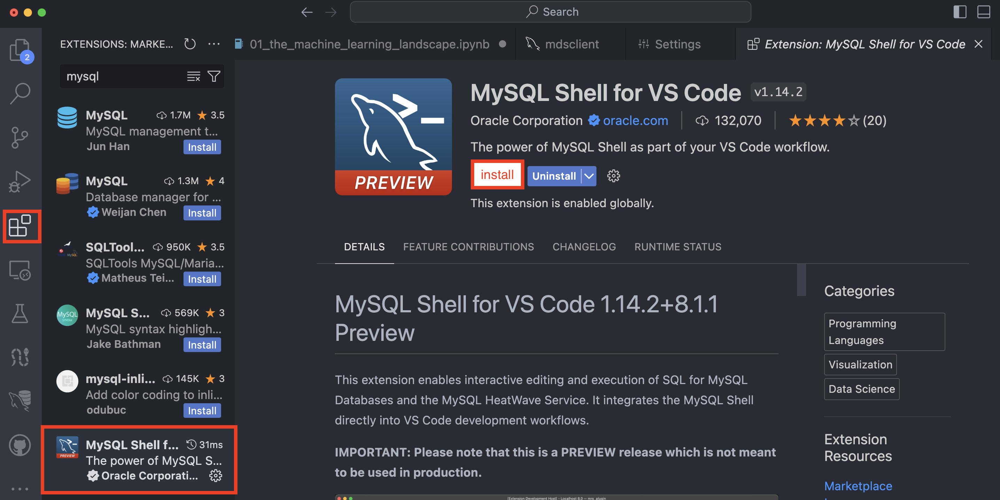
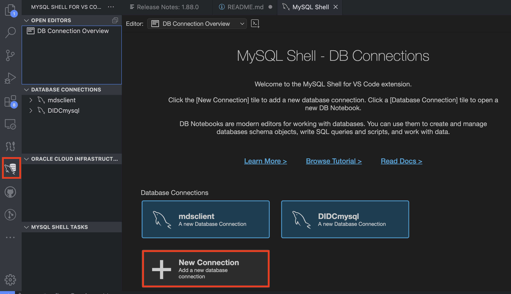
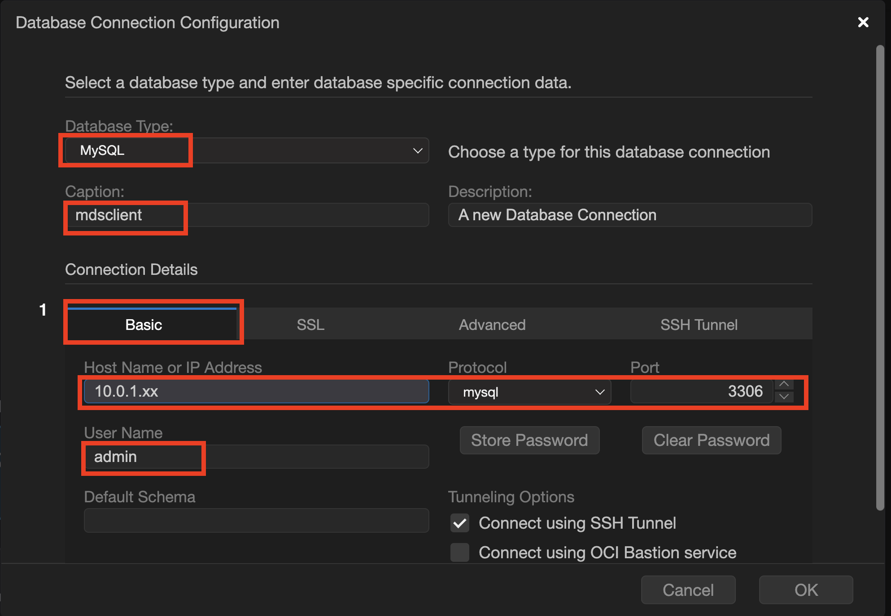
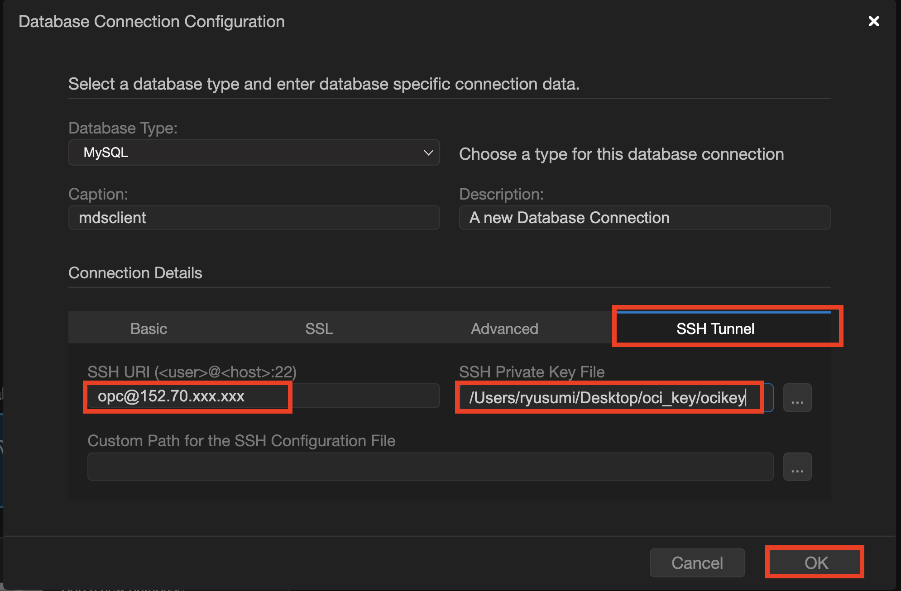
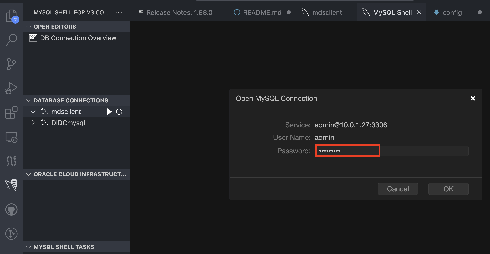
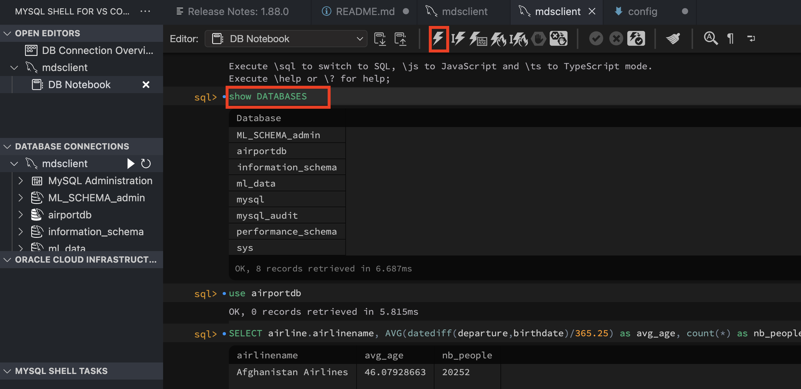

## VSCode_MySQLHeatWave 
How to connect MySQL HeatWave service via VS Code using MySQL Shell extention

VS Code 에서 MySQL Shell extention을 이용해 MySQL HeatWave 서비스에 접속 및 쿼리 실행는 방법 

### 1. MySQL Shell 확장을 VS Code 에 설치
- VS Code 앱에서 왼쪽의 Extentions 클릭 > MySQL Shell 로 검색 > MySQL Shell extention 설치

### 2. MySQL Shell에서 MySQL HeatWave Connection 설정
- VS Code 앱에서 왼쪽의 새로 만들어진 MySQL Shell 메뉴(돌고래모양) 클릭 > 화면의 New Connection 클릭

- Database Connection Configuration 설정  
  * Database type은 mysql로 설정 후 **Basic 탭**에서 MySQL HeatWave 서비스 private IP와 관리자 ID 입력

  * **SSH Tunnel 탭**에서 SSH URI에 opc@베스천서버의 IP 를 입력하고 SSH Private Key File 에 프라이빗키 파일위치를 명시해줌
  

  * 생성된 connection을 클릭해주면 ID/Password 넣는 화면이 나오고 패스워드를 넣어주면 연결
  

  ### 3. MySQL Shell에서 SQL 쿼리 실행
  - 쿼리 작성 후 위의 번개모양을 클릭하면 실행됨
  